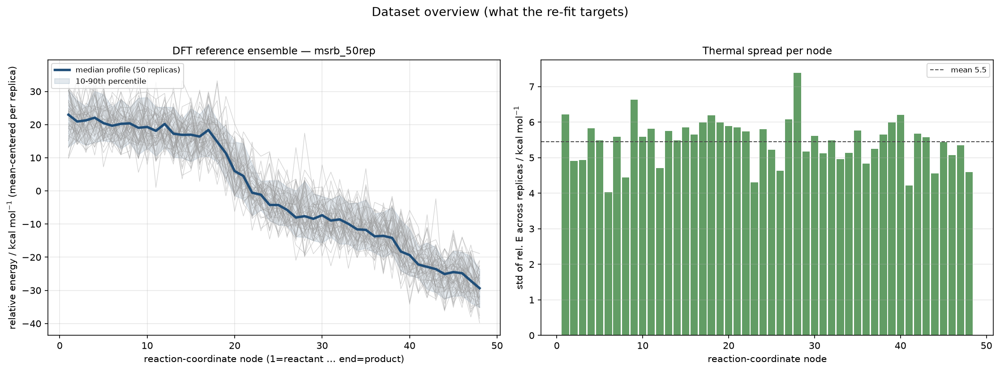
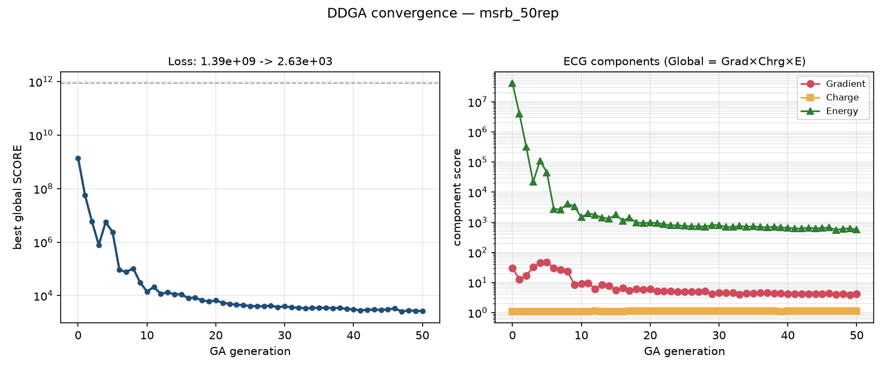
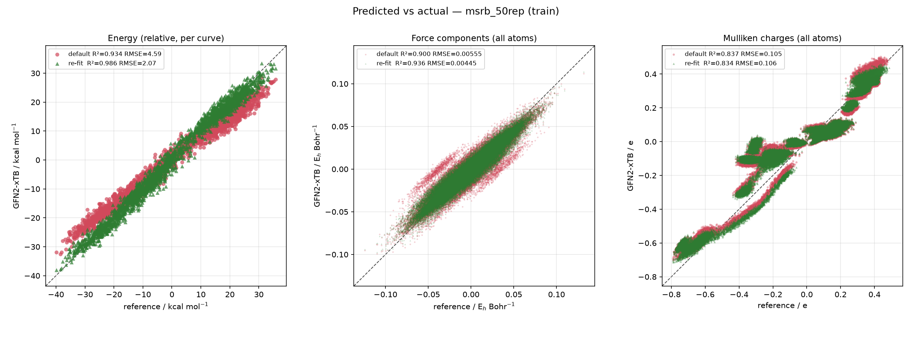
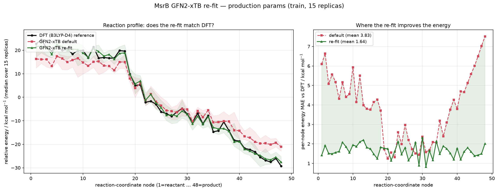

# Reparametrization of GFN2-xTB for the MsrB cysteine active site

*Methods and results for the ORCA-referenced GFN2-xTB re-fit of the **cysteine** MsrB
variant (S-only, `msrb_50rep`), produced with this repository. The selenocysteine
variant is treated in a companion document (to be added). Bracketed `[...]` items are
placeholders to fill or cite.*

---

## 1. Reference data

Reference single-point calculations were performed with ORCA [ver.] at the
**B3LYP-D4/def2-TZVP** level (`EnGrad` task) on the capped quantum-mechanical region of the
MsrB active site: a **47-atom** cluster of composition **C₁₂H₂₇N₄O₂S₂** (net charge +1,
singlet). The `EnGrad` task yields, for every structure, the total energy, the Cartesian
nuclear gradient, and the atomic (Mulliken and Löwdin) charges. Calculations were carried
out in the gas phase on the isolated QM region, following the rationale that fitting the
*intrinsic* semiempirical Hamiltonian—rather than a specific electrostatic embedding—yields
parameters that transfer between environments and avoids overfitting to a particular MM
context [Velázquez-Libera et al., *J. Chem. Theory Comput.* **2025**, 21, 5118].

Configurations were sampled along the characterized reaction path, comprising **48 nodes**
(positions along the reaction coordinate, node 1 = reactant … node 48 = product) with
**50 replica snapshots** per node, for a nominal total of **2400 reference structures**.
Each structure was stored as a compact per-structure JSON record (total energy, and, per
atom, element, Cartesian coordinates, Mulliken/Löwdin charge, and gradient). A
self-consistent-field / quality-control screen with stock GFN2-xTB flagged a small number of
pathological geometries (non-converged or duplicate snapshots), which were excluded prior to
fitting; all remaining structures were retained.



**Figure 1. What the re-fit targets.** *Left:* the DFT (B3LYP-D4) reference ensemble — the
per-replica relative-energy profile along the 48-node reaction coordinate (thin grey traces,
50 replicas; the 10–90th percentile band shaded), with the median profile in blue. The
reaction is markedly exothermic, spanning ≈ +23 kcal·mol⁻¹ (reactant) to
≈ −30 kcal·mol⁻¹ (product). *Right:* the thermal spread (standard deviation of the
mean-centered relative energy across the 50 replicas) at each node, mean ≈ 5.5 kcal·mol⁻¹ —
this is the intrinsic conformational noise the semiempirical model must reproduce on
average, not fit point-by-point.

---

## 2. ORCA reference ingestion

The optimization engine is the multiobjective evolutionary reparametrization framework of
Velázquez-Libera et al. (`gfn2-xtb_paramfitter`), which natively consumes Gaussian outputs
via cclib. To use **ORCA** reference data we added a program-agnostic ingestion layer that
parses the compact ORCA `EnGrad` JSON records and assembles them into the array-based dataset
consumed by the framework's JSON objective (`ECGFittingV3Json` / `JSONCurveHandler`). During
assembly, units are harmonized to those expected by the fitter—energies converted to
kcal·mol⁻¹, coordinates to Bohr, gradients retained as the energy gradient
(d*E*/d*x*, Eₕ·Bohr⁻¹; internally negated to forces), and charges in *e*—and the replica
snapshots are grouped into independent relative-energy "curves" (one curve per replica index,
each spanning the 48 nodes). This route also sidesteps program-specific conventions (e.g. the
sign difference between Gaussian "Forces" = −gradient and ORCA "CARTESIAN GRADIENT" =
+gradient). Per-system structure exclusions and train/validation partitioning (by replica
index) are applied at this stage.

Because several near–transition-state geometries have small HOMO–LUMO gaps, all xTB single
points were evaluated with Fermi smearing at an electronic temperature of **500 K** and up to
**300 SCF iterations**, a setting verified to guarantee convergence across the dataset while
perturbing well-behaved structures negligibly (per-atom Mulliken change ≲ 0.003 *e*).

The tunable GFN2-xTB parameters for this system comprise the element-specific parameters of
**H, C, N, O and S** (75 parameters; the stock bundled `HCONS` template). Both sulfur atoms
of the QM region are therefore fully tunable; no non-standard elements are present, so the
default parameter set applies without extension. *(The reactive selenocysteine variant
requires additionally exposing selenium's 20 element parameters — 95 tunable in total — and
is documented separately.)*

---

## 3. Multiobjective reparametrization

Parameters were optimized against the DFT reference by simultaneously minimizing the
discrepancy in three properties:

1. the **relative potential-energy profile** along each replica curve (both its shape, via
   the non-redundant matrix of pairwise energy differences, and its RMSE after
   mean-centering);
2. the **atomic Mulliken charges**; and
3. the **atomic gradients** (norm of the force-difference vector).

These are combined into a single global score, defined as the **product** of the gradient,
charge and energy sub-scores, each constructed with exponential penalty terms that heavily
weight large local deviations [Velázquez-Libera et al.]. Because the present reaction spans
≈ 60 kcal·mol⁻¹ end-to-end, the energy-penalty reference scale (`ref_ener`) was set to
**60 kcal·mol⁻¹** to keep the product objective finite and well-conditioned.

The score was minimized with the **Dynamic Domain Genetic Algorithm (DDGA)**: a
Latin-hypercube-initialized population (seeded with the stock GFN2-xTB parameters), tight
variable bounds of **±2 %** about each stock value, and dynamic expansion of the search
domain toward promising regions. Production settings were **population 80**, up to **50
generations**, with early stopping after **12 generations without improvement**; the run used
40 CPU cores and completed in ≈ 7.9 h. The optimized parameters are exported as a standard
GFN2-xTB parameter file (`param_gfn2-xtb.txt`) for direct use in QM/MM.



**Figure 2. DDGA convergence.** *Left:* the best global score across generations, falling
from ≈ 1.4 × 10⁹ (generation 0) to ≈ 2.5 × 10³ at convergence (dashed line marks the stock
default score, ≈ 8.6 × 10¹¹). *Right:* the three multiplicative components of the objective
(Global = Gradient × Charge × Energy). The **energy** term (green) dominates and drives
essentially all of the improvement; the **gradient** term (red) is refined modestly; the
**charge** term (orange) is already near-optimal for this S-only system and stays ≈ 1
throughout — foreshadowing the near-flat charge parity below.

---

## 4. Results

### 4.1 Fit quality on the training set

The production fit was evaluated against the full training ensemble. Correlation
(predicted-vs-reference) improves sharply for the energies and appreciably for the forces;
the Mulliken charges — already well described by stock GFN2-xTB for this system — are
essentially unchanged.



**Figure 3. Predicted vs. reference on the training set** (stock GFN2-xTB in red, re-fit in
green; dashed = ideal *y* = *x*).

| Property | Stock GFN2-xTB | Re-fit | Unit |
|---|---|---|---|
| Energy (relative, per curve) | R² = 0.934, RMSE = 4.59 | **R² = 0.986, RMSE = 2.07** | kcal·mol⁻¹ |
| Force components (all atoms) | R² = 0.900, RMSE = 0.00555 | **R² = 0.936, RMSE = 0.00445** | Eₕ·Bohr⁻¹ |
| Mulliken charges (all atoms) | R² = 0.837, RMSE = 0.105 | R² = 0.834, RMSE = 0.106 | *e* |

The re-fit **more than halves the energy RMSE** (4.59 → 2.07 kcal·mol⁻¹) and tightens the
force correlation, while leaving charges statistically unchanged — consistent with the
component decomposition in Figure 2, where the charge score was already saturated.

### 4.2 Reaction profile

Averaged over replicas, the re-fit reproduces the DFT reaction profile far more faithfully
than stock GFN2-xTB, which systematically overstabilizes the reactant plateau and the product
well.



**Figure 4. Median reaction profile vs. DFT.** *Left:* the median relative-energy profile
along the reaction coordinate — DFT reference (black), stock GFN2-xTB (red), and re-fit
(green), with shaded replica bands. *Right:* the per-node energy MAE against DFT; the re-fit
(green) reduces the mean per-node error from **3.83 to 1.64 kcal·mol⁻¹** and, crucially,
removes the large systematic errors at the reactant (nodes ≈ 1–18) and product
(nodes ≈ 40–48) termini where stock GFN2-xTB deviates by 4–7 kcal·mol⁻¹.

### 4.3 Generalization (out-of-sample validation)

Because the production parameter set is fit to **all** replicas (for maximum use in MD), two
independent held-out protocols were run to estimate generalization. Errors are reported as
the mean after skipping gross outliers (> 10 × MAD); the fully robust median is given in
parentheses.

**(A) Random 80/20 split** (node-agnostic; *interpolation* within the sampled region):

| Quantity | Stock | Re-fit (train) | Re-fit (val) | Val median | Gap (val−train) |
|---|---|---|---|---|---|
| E (kcal·mol⁻¹) | 3.79 | 1.54 | 1.55 | 1.12 | +0.003 |
| q (*e*) | 0.088 | 0.079 | 0.079 | 0.066 | ≈ 0 |
| F (Eₕ·Bohr⁻¹) | 0.0030 | 0.0025 | 0.0025 | 0.0017 | ≈ 0 |

The near-zero train→validation gap indicates the model **interpolates reliably** across
thermal conformations at a given point on the reaction coordinate — the regime relevant to
QM/MM sampling.

**(B) Per-node leave-node-out CV** (6 contiguous folds; *extrapolation* to unseen points on
the reaction coordinate): held-out energy MAE **3.79 → 1.64 kcal·mol⁻¹** (median 1.32);
charge **0.088 → 0.069** (median 0.057); force **0.0030 → 0.0027** (median 0.0019). The
largest residual held-out energy errors concentrate at the reaction termini (nodes 30, 48,
12, 18, …), flagging where additional DFT sampling would most improve the fit.

---

## 5. Use in free-energy (PMF) calculations

The re-fitted GFN2-xTB parameters serve as the QM Hamiltonian in subsequent QM/MM
simulations, in which the reduced computational cost relative to DFT permits the extensive
conformational sampling required to converge the potential of mean force along the reaction
coordinate [method, e.g. Adaptive String Method / umbrella sampling], while reproducing the
higher-level reference energetics that stock GFN2-xTB fails to capture (Figures 3–4). The
small out-of-sample errors (§4.3) support using a single parameter set across the full
reaction coordinate.

---

## Reproducing this fit

```bash
XTBFIT_PARAMSET=HCONS \
XTBFIT_INPUT=/path/to/data/msrb_50rep/engrad \
XTBFIT_OUTPUT=$HOME/xtb_runs/msrb_50rep \
XTBFIT_NCPUS=40 \
nohup bash run_all.sh > $HOME/xtb_runs/msrb_50rep/run_all.log 2>&1 &
```

Production settings (Stage 2): POP 80, ITERS 50, MNIWI 12, bounds ±2 %, `ref_ener` 60,
`XTB_ETEMP` 500 K, `XTB_MAXITER` 300. The figures above are the pipeline's own outputs
(`dataset_overview.png`, `loss_curve.png`, `parity_plots.png`, `profile_median_clean.png`).

---

### Key references
- C. Bannwarth, S. Ehlert, S. Grimme. *J. Chem. Theory Comput.* **2019**, 15, 1652 (GFN2-xTB).
- E. Caldeweyher et al. *J. Chem. Phys.* **2019**, 150, 154122 (D4 dispersion).
- J. L. Velázquez-Libera, R. Recabarren, E. Vöhringer-Martinez, Y. Salgueiro, J. J. Ruiz-Pernía,
  J. Caballero, I. Tuñón. *J. Chem. Theory Comput.* **2025**, 21, 5118 (MOOP/DDGA reparametrization).
- [Adaptive String Method / PMF reference, e.g. Zinovjev & Tuñón, *J. Phys. Chem. A* **2017**, 121, 9764.]
